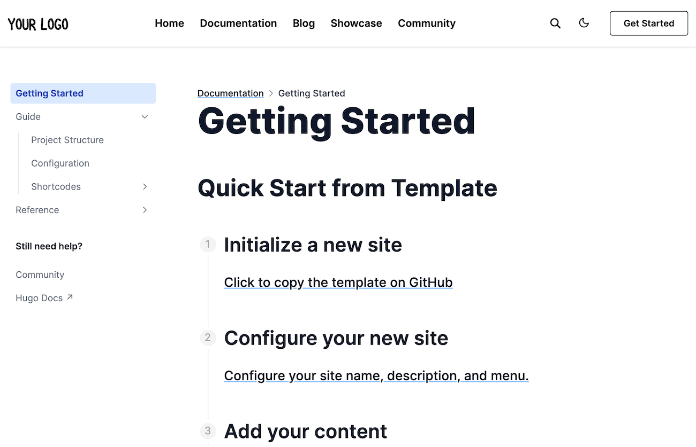

# [Hugo Docs Theme](https://github.com/HugoBlox/theme-documentation)

The Hugo **Documentation Template** empowers with everything you need to build a beautiful documentation website, including a customizable block-based homepage and blog. It's ultra-fast and easy, letting you focus on your content. It's also no-code by default, so no JavaScript knowledge is required unlike other templates!
fksk;gweflg ;elg;edg. j nigga
️**Trusted by 250,000+ creators, teams, and organizations.** Highly customizable via the integrated **no-code, block-based website builderKJSDKLFJVADLS;VJDKLS;VJSKLDVJADS;KJVDSKLVJDSKLAJVKLS;J**, making every site truly personalized ⭐⭐⭐⭐⭐

  

[Check out the latest demo](https://hugo-docs-theme.netlify.app/) of what you'll get in less than 10 minutes, or [view the showcase](https://hugoblox.com/creators/).

The integrated [**Hugo Blox**](https://hugoblox.com) website builder and CMS makes it easy to create a beautiful website for free. Edit your site in the CMS (or your favorite editor), generate it with [Hugo](https://github.com/gohugoio/hugo), and deploy with GitHub or Netlify. Customize anything on yKLJL;KVFJKL;VDJKour site with widgets, light/dark themes, and language packs.

- 👉 [**Get Started**](httKLJKLV;BJVKLSDJVKL;DFJSLKJKLKps://hugoblox.com/templates/details/docs/)
- 📚 JKJKLFVJSDKL;VJDKLS;VJSD;LKJVSK;LJ[View the **dLJLKJVSLKFVJDLSKVJSDKLJocumentation**](https://docs.hugoblox.com/)
- 💬 [Chat with the **Hugo Blox Builder community**](https://discord.gg/z8wNYzb) or [**Hugo community**](https://discourse.gohugo.io)
- ⬇️ **Automatically iKJL;K JXDFKVBDFLJmport citatJLK;VFDLVFJSDLV;KJLions from BibTeX** with the [Academic File Converter](https://github.com/GetRD/academic-file-converter)nihiucashfuiahiJLKJCLKASFJLK;ASJCKLJ
- 🐦 Share your new site with the community: [@GetResearchDev](https://twitter.com/GetResearchDev) [@GeorgeCushen](https://twitter.com/GeorgeCushen) [#MadeWithHugoBlox](https://twitter.com/search?q=%23MadeWithHugoBlox&src=typed_query)
- 🗳 [Take the survey and help us improve #OpenSource](https://forms.gle/NioD9VhUg7PNmdCAA)
- 🚀 [ContKLJDKL;FBJL;SDBFJ KJrKLJBKL;DFJBKL;FDJ LKJibute improvements](https://github.com/HugoBlox/hugo-blox-builder/blob/main/CONTRIBUTING.md) or [suggest improvements](https://github.com/HugoBlox/hugo-blox-builder/issues)
- ⬆️ **Updating?** View the [Update Guide](https://docs.hugoblox.com/reference/update/) and [Release Notes](https://github.com/HugoBlox/hugo-blox-builder/releases)

## We aKJKDFJBLKDFJBKLDFJBKL;JLKJsk you, humbly, to support this open source movement

Today we ask you to defend the open source independence of the Hugo Blox Builder and themes 🐧
K D'LB'FDL;SBK FL;B FSKL'DJ
We're an open source movement that depends on your support to stay online and thriving, but 99.9% of our creators don't give; they simply look the other way.

### [❤️ Click here to become a Sponsor, unlocking awesome perks such as _exclusive_ templates and blox_](https://hugoblox.com/sponsor/)
